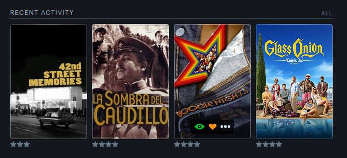
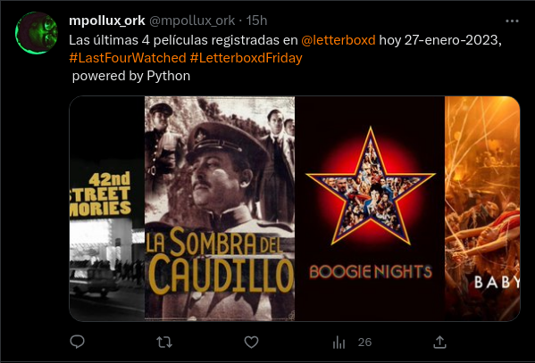

# LAST FOUR LETTERBOXD
# README.md

This script tweets a collage of the four last movies logged in your letterboxd account for the past week. 

For some time now, every friday on twitter is [#LetterboxdFriday](https://twitter.com/hashtag/LetterboxdFriday); the official [@letterboxd account](https://twitter.com/letterboxd) invites users to post their last four movies logged with the hashtag [#LastFourWatched](https://twitter.com/hashtag/LastFourWatched) . I just thought of a way of automating this activity.

This is the actual image of my letterboxd recent activity:

This is the tweet generated by the script:

The reason that Glass Onion appears on the letterboxd one, but Babylon is in the tweet, is because I logged Glass Onion yesterday, but it was actually watched on December 30th, so the script actually checks the watched date to add movies only from the past week.

# Inspiration
This script is based on the [tutorial](https://devanshumehta.com/2020/01/04/building-a-movie-diary/) of Devanshu Mehta

# Dependencies
It uses the following technologies and APIs:

- feedparser
- ssl
- tmdbv3api
- datetime
- urllib.request
- PIL
- random
- string
- numpy
- tweepy
- configparser

# How to use

Create a config.ini file in the same directory as the script and configure the following fields with your own credentials:

- tw_api_k: Twitter API key
- tw_api_ks: Twitter API key secret
- tw_acc_tk: Twitter account token
- tw_atk_sc: Twitter account token secret
- tmdb_key: TMDb API key
- tmdb_language: TMDb language
- lettrbx_usr: Letterboxd username

Create a folder named tmposter and place there the "generic.jpg" file.

Run the script with python lastfour.py

# Notes

- The script uses the latest movies that you've logged in your Letterboxd account in the past week to create the collage.
- The script downloads the movie posters from TMDb and saves them in a tmpost directory.
- The script tweets the collage using your configured Twitter credentials.

# How to Improve

- The script uses the first poster found in the TMDB API, if the movie doesn't have a poster it uses a generic image, we could use other resources like IMDB or Wikipedia to get the movie's images.
- We migh actually add the score for the movies (number of stars) since that information is included in the RSS feed.

# Contributions
- Any contributions are welcome, feel free to open a pull request or an issue.

# License
- This project is licensed under the MIT License - see the LICENSE file for details.

# Resources

- The script uses the TMDb API: https://developers.themoviedb.org/3/getting-started/introduction
- The script uses the public Letterboxd RSS feed for every user: https://letterboxd.com/<letterboxd_user_profile>/rss/ (Here is [mine](https://letterboxd.com/mpollux_ork/rss/))
- The script uses the Twitter API: https://developer.twitter.com/en/docs

# Reference

- https://devanshumehta.com/2020/01/04/building-a-movie-diary/
- https://bin.re/blog/tutorial-download-posters-with-the-movie-database-api-in-python/ 
- https://thecleverprogrammer.com/2021/07/31/collage-maker-using-python/
- https://www.mattcrampton.com/blog/step_by_step_tutorial_to_post_to_twitter_using_python_part_two-posting_with_photos/
